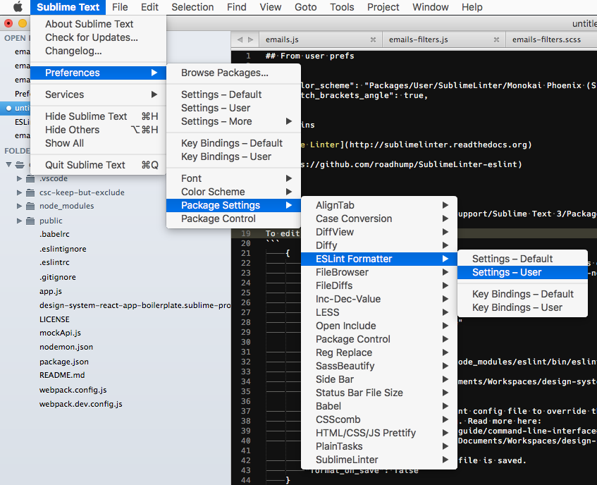

# Setting up Sublime Text JavaScript Linting


## From user prefs

```
	"color_scheme": "Packages/User/SublimeLinter/Monokai Phoenix (SL).tmTheme",
	"match_brackets_angle": true,
```

## Plugins

 - [Sublime Linter](http://sublimelinter.readthedocs.org)
 - [Sublime Linter Contrib: ESLint](https://github.com/roadhump/SublimeLinter-eslint)


## ESLint Formatter Sublime Settings
File lives at: `~/Library/Application Support/Sublime Text 3/Packages/User/ESLint-Formatter.sublime-settings`

To edit:



Note that the only way I've gotten it to find my local eslint is to set it for a specific project in the formatters "global" file. :( This is annoying, but it works.


```
	{
		// Simply using `node` without specifying a path sometimes doesn't work :(
		// https://github.com/victorporof/Sublime-HTMLPrettify#oh-noez-command-not-found
		// http://nodejs.org/#download
		"node_path": {
			"windows": "node.exe",
			"linux": "/usr/bin/nodejs",
			"osx": "/usr/local/bin/node"
		},

		"eslint_path": {
			"windows": "%APPDATA%/npm/node_modules/eslint/bin/eslint",
			"linux": "/usr/bin/eslint",
			"osx": "/Users/ccorwin/Documents/Workspaces/design-system-react-app-boilerplate/node_modules/.bin/eslint"
		},

		// Specify this path to an eslint config file to override the default behavior.
		// Passed to eslint as --config. Read more here:
		// http://eslint.org/docs/user-guide/command-line-interface#c---config
		"config_path": "/Users/ccorwin/Documents/Workspaces/design-system-react-app-boilerplate/node_modules/eslint-config-slds/index.js",

		// Automatically format when a file is saved.
		"format_on_save": false
	}
```


From `~/Documents/Workspaces/design-system-react-app-boilerplate/.eslintrc`
