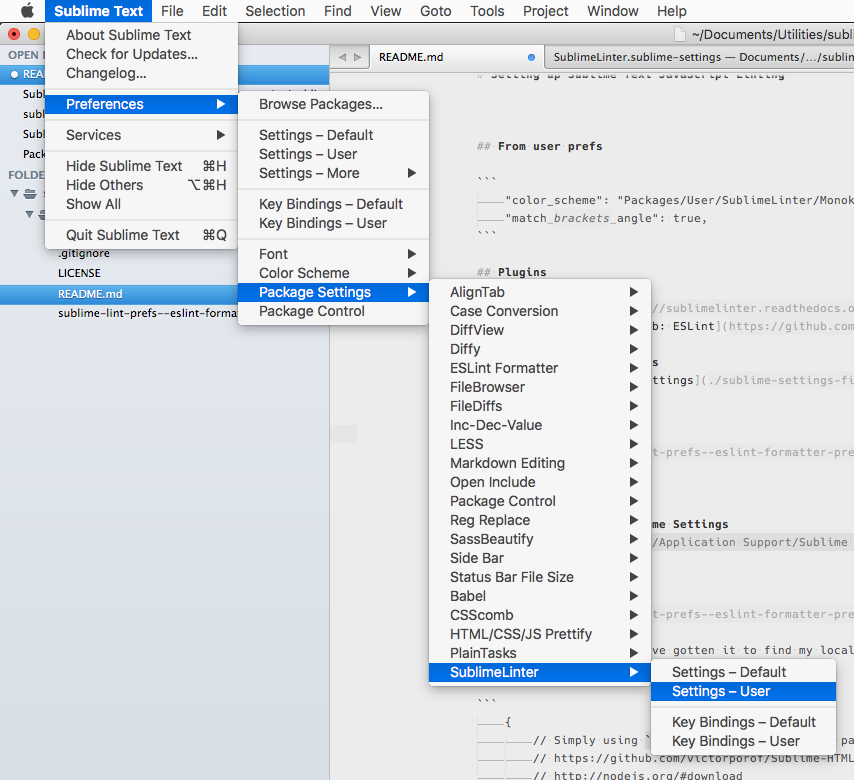
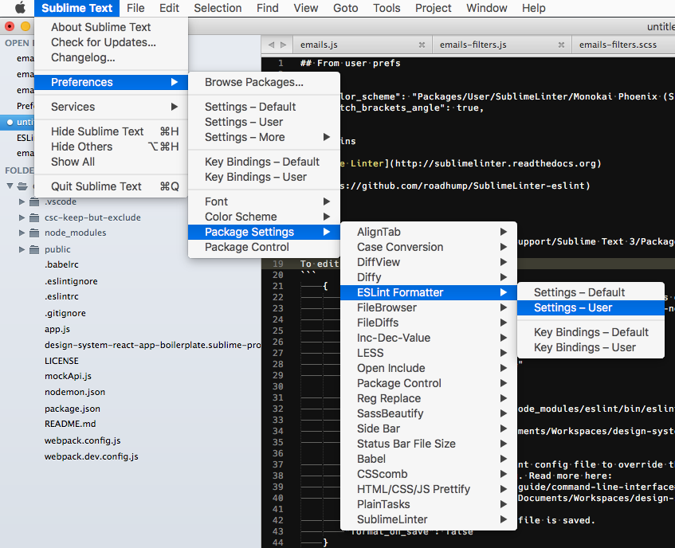

# Setting up Sublime Text JavaScript Linting

It seems to be the combination of **SublimeLinter**, **Sublime​Linter-contrib-eslint**, and **ESLint-Formatter** that does the trick.

These, combined with the [Babel Syntax definitions for ES6 JavaScript with React JSX extensions](https://packagecontrol.io/packages/Babel), gives me good syntax colouring of ES6 and .jsx, linting errors as I code, and a fair amount of auto-fixing as I save.


## Plugins

 - [SublimeLinter](https://packagecontrol.io/packages/SublimeLinter)
 - [Sublime​Linter-contrib-eslint](https://packagecontrol.io/packages/SublimeLinter-contrib-eslint)
 - [ESLint-Formatter](https://packagecontrol.io/packages/ESLint-Formatter)


## Sublime Linter Settings

### Installing

**DO NOT SKIP READING THIS PART:** [Installing SublimeLinter](http://sublimelinter.readthedocs.io/en/latest/installation.html)


### Settings

For general information on how SublimeLinter works with settings, please see [Settings][settings]. For information on generic linter settings, please see [Linter Settings][linter-settings].


See my [SublimeLinter.sublime-settings](./sublime-settings-files/SublimeLinter.sublime-settings) file.

Default Mac OS X path: `~/Library/Application Support/Sublime Text 3/Packages/User/SublimeLinter.sublime-settings`

**To edit yours:**




## Sublime Linter Contrib ESLint

### Installing

To install via Package Control, do the following:

1. Within Sublime Text, bring up the [Command Palette][cmd] and type `install`. Among the commands you should see `Package Control: Install Package`. If that command is not highlighted, use the keyboard or mouse to select it. There will be a pause of a few seconds while Package Control fetches the list of available plugins.

1. When the plugin list appears, type `eslint`. Among the entries you should see `SublimeLinter-contrib-eslint`. If that entry is not highlighted, use the keyboard or mouse to select it.


## ESLint Formatter Sublime Settings

[ESLint-Formatter.sublime-settings](./sublime-settings-files/ESLint-Formatter.sublime-settings)

Default Mac OS X path: `~/Library/Application Support/Sublime Text 3/Packages/User/ESLint-Formatter.sublime-settings`

**Note this bit from that file:**

```
	// Specify this path to an eslint config file to override the default behavior.
	// Passed to eslint as --config. Read more here:
	// http://eslint.org/docs/user-guide/command-line-interface#c---config
	"config_path": "/Users/ccorwin/Documents/Workspaces/design-system-react-app-boilerplate/node_modules/eslint-config-slds/index.js",
```

Once I pointed it directly to the `eslint-config-slds/index.js` file, it started using the settings correctly. No other amount of voodoo or incantations seemed to work.


To edit yours:



Note that the only way I've gotten it to find my local eslint is to set it for a specific project in the formatters "global" file. :( This is annoying, but it works.


## .eslintrc

See my [.eslintrc](./sublime-settings-files/dot-eslintrc) file.


## SublimeLinter and colour schemes

From the [docs](http://sublimelinter.readthedocs.io/en/latest/usage.html#choosing-color-schemes).

	In order to color errors, warnings and gutter icons correctly, SublimeLinter relies on specific named colors being available in the current color scheme. Whenever a color scheme is loaded — either implicitly at startup or by selecting a color scheme — SublimeLinter checks to see if the color scheme contains its named colors. If not, it adds those colors to a copy of the color scheme, writes it to the `Packages/User/SublimeLinter` directory with a “ (SL)” suffix added to the filename, and switches to the modified color scheme.

	For example, if you select Preferences > Color Scheme > Color Scheme - Default > Monokai, SublimeLinter will convert it, write the converted color scheme to `Packages/User/SublimeLinter/Monokai (SL).tmTheme`, and switch to that color scheme. If you then open the Preferences > Color Scheme menu, User > SublimeLinter > Monokai (SL) is checked.


[cmd]: http://docs.sublimetext.info/en/sublime-text-3/extensibility/command_palette.html
[linter-settings]: http://sublimelinter.readthedocs.org/en/latest/linter_settings.html
[settings]: http://sublimelinter.readthedocs.org/en/latest/settings.html
